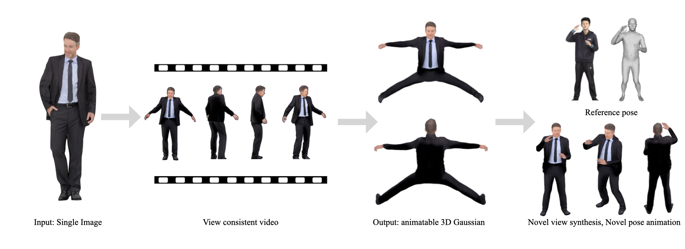
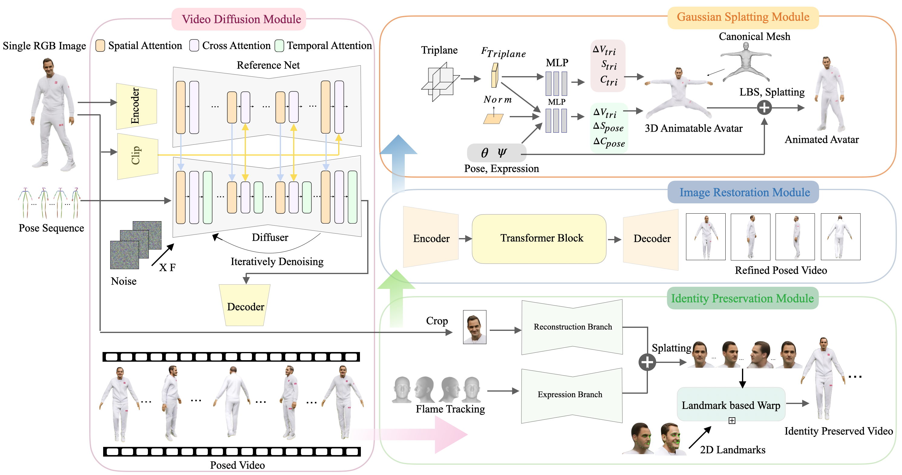

<div align="center">

# SVAD: From Single Image to 3D Avatar via Synthetic Data Generation with Video Diffusion and Data Augmentation

${{\color{Black}\Huge{\textbf{  CVPR Workshop\ 2025\ \}}}}\$


[](https://arxiv.org/abs/2505.05475)
[](https://yc4ny.github.io/SVAD/)
[](https://github.com/yc4ny/SVAD)
[](https://github.com/yc4ny)
<a href="" target='_blank'>
    
</a>


</div>



## Overview

 SDAV creates photorealistic 3D human avatars from a single image input. Our approach combines video diffusion models with 3D Gaussian Splatting to generate high-fidelity, animatable avatars while preserving the subject's identity and appearance details.

**Key Features:**
- Single-image input to full-body 3D avatar generation

## News
- [2025/05/08] Code has been released. 
- [2025/03.30] SVAD has been accepted to CVPR 2025 Workshop.

## Installation

### Requirements
- CUDA 12.1
- Python 3.9
- PyTorch 2.3.1


### Environment Setup
First you need to clone the repo:
```
git clone https://github.com/yc4ny/SVAD.git
cd SDAV
```
Our default installation method is based on Conda package and environment management:
```bash
cd envs/
conda env create --file svad.yaml
conda activate svad
```
Install required packages via pip: 
```bash
pip install pip==24.0 # For pytorch-lightning==1.6.5
pip install cmake     # For dlib 
pip install -r svad.txt 
```
Install CUDA related packages:
```bash
conda install -c "nvidia/label/cuda-12.1.1" cuda-nvcc cuda-cudart-dev libcurand-dev
conda install -c nvidia cuda-profiler-api
```
Install MMPose:
```bash
pip install --no-cache-dir -U openmim 
pip install mmdet
pip install mmcv==2.2.0 -f https://download.openmmlab.com/mmcv/dist/cu121/torch2.3/index.html
pip install mmpose
```
Install modified version of 3DGS:
```bash
cd diff_gaussian_rasterization_depth/
python setup.py install
cd .. # Return to envs directory
```
Install 3DGS Renderer:
```bash
cd diff-gaussian-rasterization
pip install . 
cd ../../ # Return to base avatar directory
```

### Downloads

You can download the required files to run this code with:
```bash
gdown 1_dH5-0fMTfED_BI1h_fQcL2bHyLqNBot
python utils/extract_zip.py # This will put extracted files in place. 
rm -rf Avatar.zip
```
### 🚨Package Compatibility Notes🚨

To ensure seamless execution of our pipeline, certain package modifications are required. Please apply the fixes detailed in [FIX.md](docs/FIX.md) before running the code. These modifications address compatibility issues with dependencies and will prevent runtime errors during execution.

## Creating Synthetic Data for Avatar Training
###  Pipeline


### Training Avatars with Script 
We provide a script to automate the entire pipeline for avatar generation from a single image. This script supports parallel processing (training multiple avatars at the same time 1 per 1 gpu).
<br>
Put your input image in *data/{name_of_image}/ref.png*. 
<br>
In our example we place image in *data/female-3-casual/ref.png/*.

```bash
# For a single avatar
bash script.sh <name_of_image> <gpu_id>

# Examples for parallel processing on multiple GPUs
bash script.sh female-3-casual 0  # Running on GPU 0
bash script.sh thuman_181 1    # Running on GPU 1
```
If you have correctly installed the environment and applied the package fixes in [FIX.md](docs/FIX.md), there should be no problem running the automated script. However, if there are issues, we also provide a step by step guide to train your avatar. Follow the details in [TRAIN.md](docs/TRAIN.md).

### Avatar Rendering

#### Neutral Pose
After training your avatar, you can render the rotating avatar with neutral pose: 
```bash
cd avatar/main/
python get_neutral_pose.py --subject_id {SUBJECT_ID} --test_epoch 4
```

#### Animation
You can animate your avatar with :
```bash
python animation.py --subject_id {SUBJECT_ID} --test_epoch 4 --motion_path {MOTION_PATH}
```
The rendering code is based on [ExAvatar](https://github.com/mks0601/ExAvatar_RELEASE) so to prepare motion sequences, please refer to this [link](https://github.com/mks0601/ExAvatar_RELEASE/tree/main/fitting).

## Acknowledgements
Parts of the code are taken or adapted from the following repos:
- [MusePose](https://github.com/TMElyralab/MusePose)
- [ExAvatar](https://github.com/mks0601/ExAvatar_RELEASE)
- [BFRffusion](https://github.com/chenxx89/BFRffusion)
- [GAGAvatar](https://github.com/xg-chu/GAGAvatar)
- [Modified 3DGS](https://github.com/leo-frank/diff-gaussian-rasterization-depth)
- [pytorch3D](https://github.com/facebookresearch/pytorch3d)

## Citing
If you find this code useful for your research, please consider citing the following paper:

```bibtex
@inproceedings{choi2025svad,
    title={SVAD: From Single Image to 3D Avatar via Synthetic Data Generation with Video Diffusion and Data Augmentation},
    author={Yonwoo Choi},
    booktitle={CVPR 2025 Workshop SyntaGen: 2nd Workshop on Harnessing Generative Models for Synthetic Visual Datasets},
    year={2025}
}
```
